# Azure Cognitive Search: Utilizando AI Search para indexação e consulta de Dados

## Serviço de Inteligência de IA do Azure

O Azure AI, oferecido pela Microsoft, é uma plataforma de inteligência artificial que fornece uma variedade de serviços para desenvolvimento, implantação e gerenciamento de aplicativos baseados em IA. Dentro dessa plataforma, os Serviços Cognitivos do Azure são uma suíte de APIs pré-construídas que abrangem diversas funcionalidades de IA, como visão, fala, linguagem, conhecimento e busca. 
Os principais pontos do serviço de inteligência do Azure AI incluem: Visão Computacional, Fala, Linguagem, Conhecimento, Machine Learning, Análise de Dados e Serviços Específicos de Indústria.

## Realizando Buscas Cognitivas no AI Search

Exemplo: Opiniões e/ou reclamações de cliente numa Cafeteria. 

Acessar o Lab pelo portal Azure para criar um novo recurso do Azure AI Search.

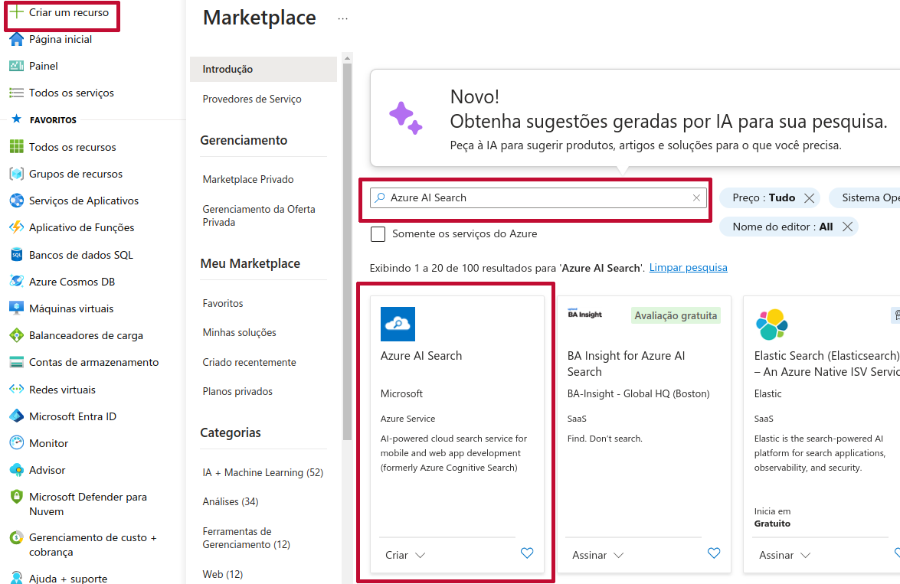

Criar um Serviço de Pesquisa.

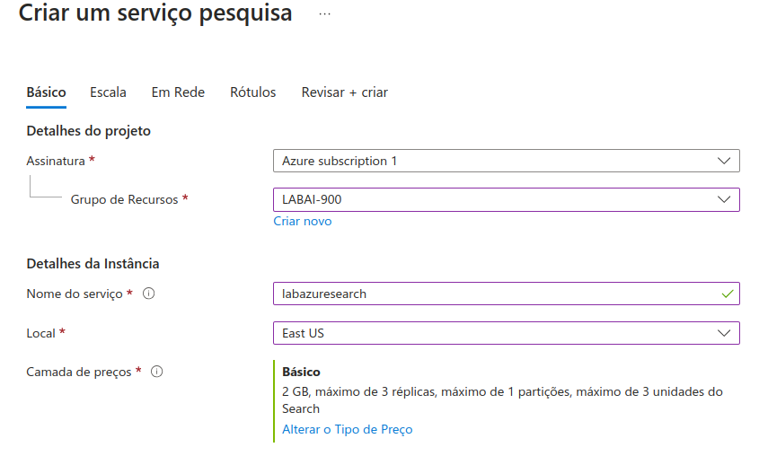

Criar um recurso de AI Machine Learning de Serviços Cognitivos.

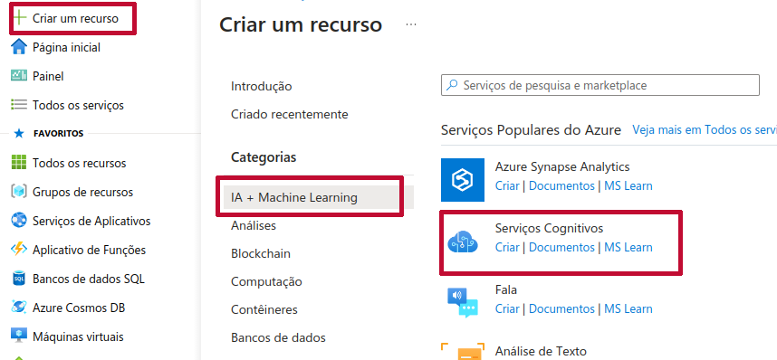

Criar uma conta de armazenamento. Clicar em criar na próxima página e configure conforme imagens a seguir.

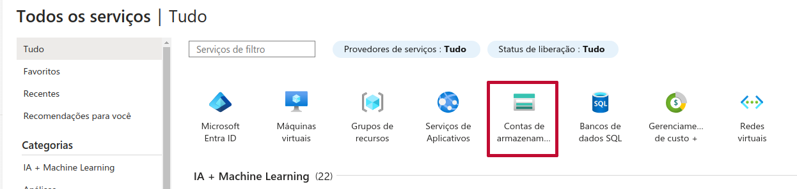

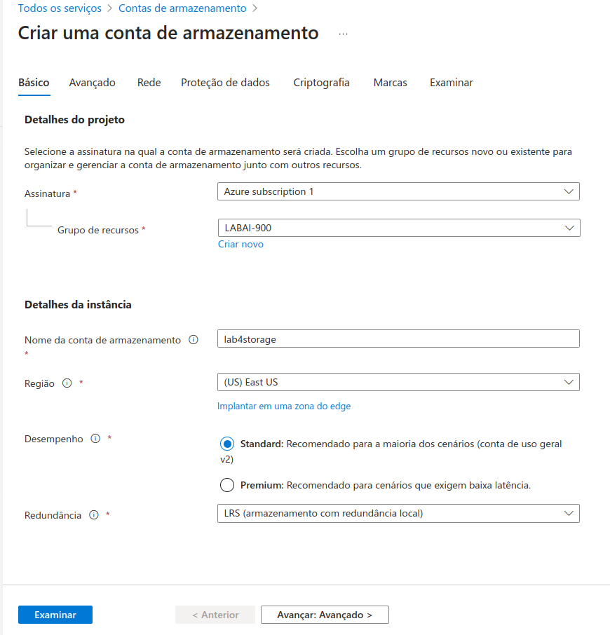

**Configurando a conta de armazenamento**. Na tela do recurso, clicar em Configuração na barra lateral. Devemos permitir o acesso anônimo ao Blob.

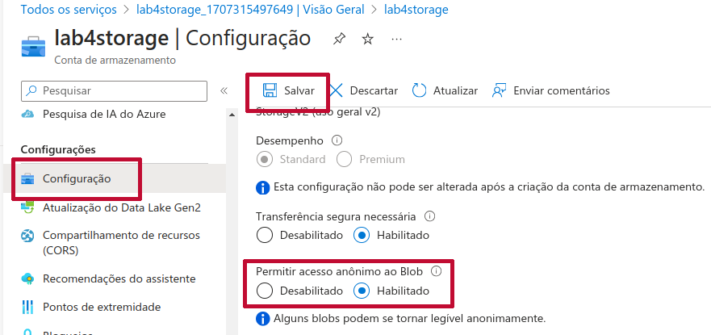

Crie novo Contêiner.

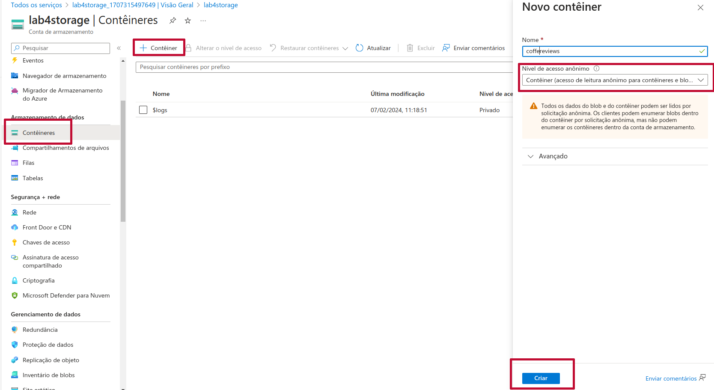

A documentação disponibiliza um link para salvar os documentos contendo as avaliações de clientes. Selecione em Carregar e faça o upload dos arquivos que estão em formato doc.

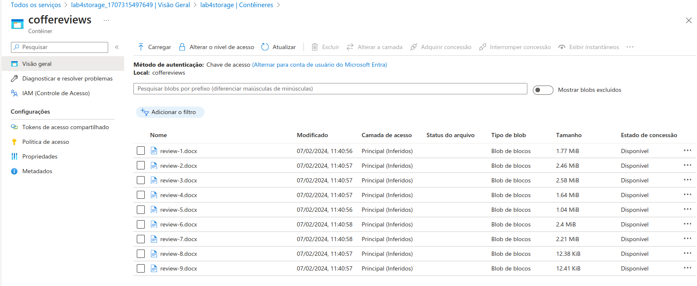

Retornamos a todos os recursos e, no mecanismo de busca criado, no caso o *labazuresearch* clicar em importar dados e realizar a indexação.

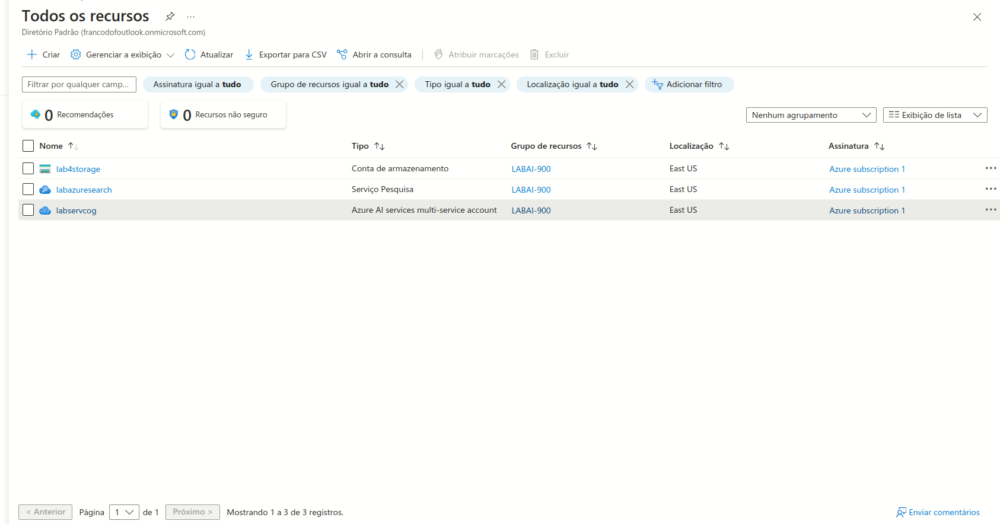

De volta ao labazuresearch pode-se testar algumas pesquisas clicando no canto superior em Gerenciador de pesquisa.

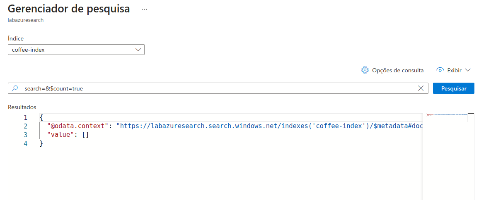

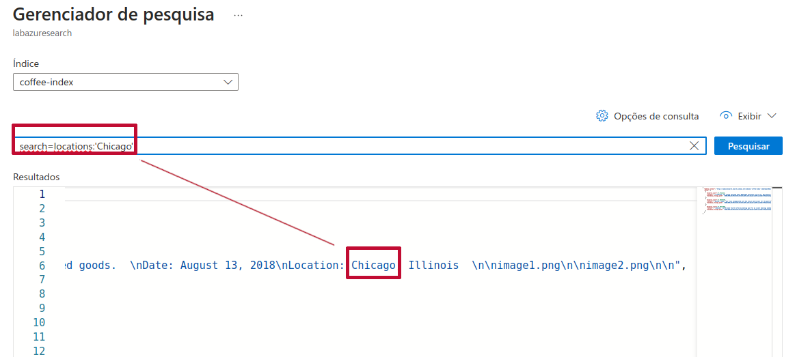

A ferramenta permite criar um serviço IA, disponibilizando para o administrador a fácil consulta de documentos e a satisfação dos clientes. Além da localização de pessoas, frases-chave, seus sentimentos e outras aplicações.

## Referências

https://learn.microsoft.com/en-us/training/paths/document-intelligence-knowledge-mining/

https://microsoftlearning.github.io/mslearn-ai-fundamentals/Instructions/Labs/11-ai-search.html